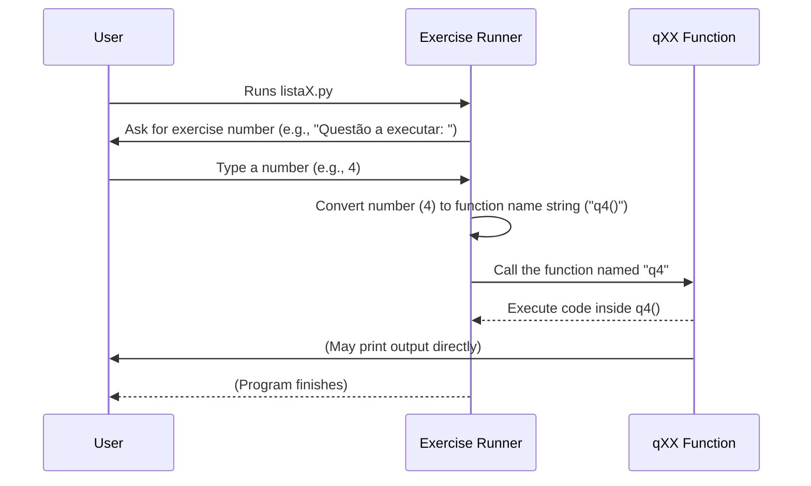

# Chapter 2: Exercise/Question (qXX Function)

Welcome back! In the [previous chapter](01_exercise_runner_.md), we learned about the **Exercise Runner**, that helpful piece of code that lets you easily pick and run any exercise from a file like `lista1.py` just by typing its number.

But what exactly does the Exercise Runner *run*? It runs specific pieces of code, each designed to solve one particular exercise. These pieces of code are organized into something called **functions**, and in this project, they follow a special naming pattern: `qXX`.

Think of a file like `lista1.py` as a cookbook for solving basic programming problems. Each problem is a recipe, and each recipe is stored inside its own container – that container is a `qXX` function. For example, the solution to Exercise 1 is in a function named `q1`, the solution to Exercise 2 is in `q2`, and so on.

Let's dive into what a `qXX` function is and how it holds the solution for an exercise.

## What is a Function? (A Simple Recipe)

In Python, a **function** is like a mini-program within your main program. It's a block of code that performs a specific task. You give it a name, and you can run that block of code whenever you need it just by calling its name.

Think of it like a recipe for baking cookies:
*   It has a **name** (e.g., "Chocolate Chip Cookies").
*   It has a list of **ingredients** you might need (sometimes functions need 'inputs', called arguments).
*   It has a list of **steps** to follow (the code inside the function).
*   It **produces something** at the end (the cookies, or a result in programming).

In our `lp20251` project, the `qXX` functions are the "recipes" for solving the exercises.

## The `qXX` Pattern

You'll notice functions named `q01`, `q02`, `q03`, `q04`, and so on, throughout the `listaX.py` files.

*   The `q` stands for "questão" (Portuguese for "question" or "exercise").
*   The `XX` is a number that directly corresponds to the exercise number in the assignment list.

So, if your teacher asks you to solve Exercise 5, you'll find or write the solution code inside the function named `q5`. If they ask for Exercise 12, you'll work in `q12`.

## Anatomy of a Simple `qXX` Function

Let's look at one of the simplest examples from `lista1.py`:

```python
#1. Faça um programa que imprima o seu nome.
def q01():
    print('João Paulo')
```

*   `#1. Faça um programa...`: This is a comment explaining what the function `q01` is supposed to do (solve exercise #1). Good code often has comments!
*   `def q01():`: This is how you **define** a function in Python.
    *   `def`: This keyword tells Python you're starting a function definition.
    *   `q01`: This is the **name** of the function.
    *   `()`: These parentheses are necessary. Sometimes they hold inputs for the function (like ingredients), but for `qXX` functions in these early lists, they are usually empty because the function gets input directly from the user inside its steps.
    *   `:`: This colon marks the end of the function definition line.
*   `print('João Paulo')`: This is the **body** of the function. It's the code that runs when you *call* or *execute* the function. Notice it's indented! Indentation is very important in Python; it tells Python which lines of code belong inside the function. This single line is the entire "recipe" for `q01`.

When you run `lista1.py`, the Exercise Runner asks for a number. If you type `1`, the runner finds the function named `q01` and runs the code inside it. The code `print('João Paulo')` executes, and you see "João Paulo" appear on your screen.

Let's look at one that gets input from the user:

```python
#4. Faça um programa que leia e imprima um número inteiro.
def q04():
    numero = int(input('Digite um número inteiro: '))
    print(numero)
```

Here, the `q04()` function:
1.  Uses `input('Digite um número inteiro: ')` to show a message and wait for the user to type something. Whatever the user types is received as text.
2.  Uses `int(...)` to convert that text into a whole number (an integer).
3.  Stores that integer in a variable called `numero`.
4.  Uses `print(numero)` to display the value stored in the `numero` variable.

So, the code *inside* the `qXX` function is the complete solution to the specific exercise, using whatever Python features are needed (like printing, getting input, doing calculations, etc.).

## How the Exercise Runner Calls a `qXX` Function

Let's visualize how the Exercise Runner (from [Chapter 1](01_exercise_runner_.md)) interacts with a `qXX` function using a simple diagram:



As you can see, the `qXX` function is where the actual work for a single exercise happens. The Exercise Runner is just the mechanism that *starts* the correct `qXX` function based on user input.

## Why Use Functions Like `qXX`?

Organizing code into `qXX` functions is useful for beginners because:

1.  **Organization:** Each problem has its own clear place. It keeps the code tidy.
2.  **Isolation:** The code for `q1` doesn't interfere with the code for `q2`. You can work on one exercise without worrying about breaking others.
3.  **Testability:** The Exercise Runner allows you to easily run and test *only* the code for a specific exercise, making debugging much simpler.

Each `qXX` function is a self-contained unit designed to solve one specific task assigned by an exercise. As you progress through the course, these functions will become more complex, using concepts like conditional logic, loops, and data structures to solve more challenging problems.

## Conclusion

In this chapter, you learned that the `qXX` functions are the heart of the exercise files in the `lp20251` project. Each `qXX` function contains the specific Python code that solves a single programming exercise, acting like a distinct recipe in a cookbook. The Exercise Runner you learned about in [Chapter 1](01_exercise_runner_.md) is the tool that helps you easily select and run these individual exercise "recipes".

Now that you understand what lives *inside* those exercise files, let's look at the files themselves – how the `qXX` functions are grouped together in files like `lista1.py` and `lista2.py`.

[Next Chapter: Exercise List File (listaX.py)](03_exercise_list_file__listax_py__.md)

---

<sub><sup>Generated by [AI Codebase Knowledge Builder](https://github.com/The-Pocket/Tutorial-Codebase-Knowledge).</sup></sub> <sub><sup>**References**: [[1]](https://github.com/ifmt-cba/lp20251/blob/2353bfea16374996818c71298b449a71933ddc9f/lista1.py), [[2]](https://github.com/ifmt-cba/lp20251/blob/2353bfea16374996818c71298b449a71933ddc9f/lista2.py), [[3]](https://github.com/ifmt-cba/lp20251/blob/2353bfea16374996818c71298b449a71933ddc9f/lista3.py), [[4]](https://github.com/ifmt-cba/lp20251/blob/2353bfea16374996818c71298b449a71933ddc9f/lista4.py), [[5]](https://github.com/ifmt-cba/lp20251/blob/2353bfea16374996818c71298b449a71933ddc9f/p1.py)</sup></sub>