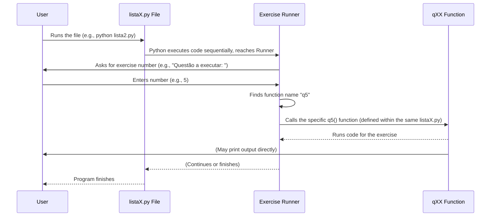

# Chapter 3: Exercise List File (listaX.py)

Welcome back! In the [previous chapter](02_exercise_question__qxx_function__.md), we looked inside the **Exercise Runner** (from [Chapter 1](01_exercise_runner_.md)) and learned that it runs specific pieces of code stored in **`qXX` functions**, where each function holds the solution to a single exercise.

But where do these `qXX` functions live? You'll find them grouped together in files with names like `lista1.py`, `lista2.py`, `lista3.py`, and so on. These are the **Exercise List Files**, and they are the topic of this chapter.

## What is a `listaX.py` File?

Think of the `lp20251` project's exercises like a textbook. Just as a textbook is divided into chapters that cover different topics (like basic math, fractions, geometry), the `lp20251` project organizes its exercises into files that cover different programming concepts.

*   `lista1.py` might contain exercises about basic input and output.
*   `lista2.py` focuses on conditional statements (like `if` and `else`).
*   `lista3.py` is all about loops (like `for` and `while`).
*   `lista4.py` introduces data collections (like lists and dictionaries).
*   And so on...

Each `listaX.py` file is essentially a "chapter" of exercises focused on a particular area of Python programming. It's a single Python file (`.py`) that contains many different `qXX` functions, all related to the same general topic.

## Why Group Exercises Like This?

Grouping exercises this way offers several benefits, especially for beginners:

1.  **Organization:** It keeps related problems together, making it easy to find exercises on a specific topic you're learning.
2.  **Focus:** When you open `lista2.py`, you know you're going to be working with `if`, `elif`, and `else` statements. This helps you focus on mastering that concept.
3.  **Manageable:** Instead of having one giant file with hundreds of exercises, they are broken down into smaller, more manageable files.

## Anatomy of a `listaX.py` File

Let's look at a simplified example of what a `listaX.py` file generally contains:

```python
'''
Exercícios sobre [Topic Name]
'''

# Some important notes or imports for this topic (optional)

# Exercise 1: [Short description]
def q1():
    # Code for exercise 1
    print("This is the solution for Exercise 1")

# Exercise 2: [Short description]
def q2():
    # Code for exercise 2
    print("This is the solution for Exercise 2")

# ... many other qXX functions ...

# Exercise 25: [Short description]
def q25():
    # Code for exercise 25
    print("This is the solution for Exercise 25")

# The Exercise Runner is usually at the very end
# It lets you pick which qXX function to run
questao = int(input('Questão a executar: '))
eval(f'q{questao}()')
```

As you can see, a typical `listaX.py` file includes:

*   **Comments at the top:** Explaining the main topic of the exercises in that file.
*   **Function Definitions:** Multiple `def qXX():` blocks, each containing the code for one specific exercise related to the file's topic.
*   **The Exercise Runner:** The familiar two lines of code at the bottom that allows you to select and run any of the `qXX` functions defined above it.

## How it All Fits Together

Now we can see the full picture, combining the concepts from the first two chapters:

1.  You choose a `listaX.py` file based on the topic you want to practice (e.g., `lista2.py` for conditionals).
2.  You run that Python file from your terminal (e.g., `python lista2.py`).
3.  Python starts executing the file from top to bottom. It reads and *defines* all the functions (`q1`, `q2`, ..., `q25`, etc.) that are inside that specific file. These functions are now ready to be called.
4.  Python reaches the **Exercise Runner** code at the bottom of the file.
5.  The Runner asks you which exercise number you want to run.
6.  You type a number (like `5`) corresponding to a `qXX` function defined *in that file*.
7.  The Runner takes your number (`5`) and uses `eval()` to call the corresponding function (`q5()`) that was defined earlier in this same `lista2.py` file.
8.  The code inside the `q5()` function runs, executing the solution for that specific exercise.

Here's a simple diagram showing this flow:



This system allows you to jump directly to any exercise within a topic file, making practice efficient.

## Conclusion

The `listaX.py` files are the backbone of the exercise structure in the `lp20251` project. They serve as organized collections ("chapters") of programming exercises (`qXX` functions), grouped by topic. By running a specific `listaX.py` file, you load all the exercises for that topic, and the [Exercise Runner](01_exercise_runner_.md) allows you to easily select and run any individual exercise (`qXX` function) within that file.

Now that you understand how exercises are organized and run, you're ready to start learning the actual programming concepts covered in these files.

[Next Chapter: Conditional Logic](04_conditional_logic_.md)

---

<sub><sup>Generated by [AI Codebase Knowledge Builder](https://github.com/The-Pocket/Tutorial-Codebase-Knowledge).</sup></sub> <sub><sup>**References**: [[1]](https://github.com/ifmt-cba/lp20251/blob/2353bfea16374996818c71298b449a71933ddc9f/lista1.py), [[2]](https://github.com/ifmt-cba/lp20251/blob/2353bfea16374996818c71298b449a71933ddc9f/lista2.py), [[3]](https://github.com/ifmt-cba/lp20251/blob/2353bfea16374996818c71298b449a71933ddc9f/lista3.py), [[4]](https://github.com/ifmt-cba/lp20251/blob/2353bfea16374996818c71298b449a71933ddc9f/lista4.py)</sup></sub>