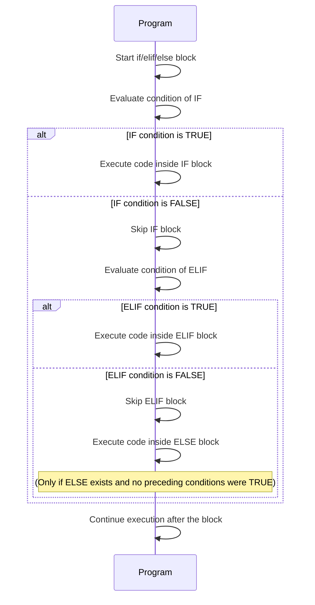

# Chapter 4: Conditional Logic

Welcome back! In the [previous chapter](03_exercise_list_file__listax_py__.md), we learned how the `listaX.py` files organize different `qXX` functions, and how the [Exercise Runner](01_exercise_runner_.md) helps us run them. Now, let's dive into a fundamental concept that allows the code *inside* those `qXX` functions to do powerful things: **Conditional Logic**.

Imagine you're writing a program that needs to respond differently depending on the situation. For example:

*   If a student's grade is 7 or higher, print "Approved".
*   If the temperature is below 0 degrees, print "It's freezing!".
*   If a user enters a number greater than 10, do one thing; otherwise, do something else.

How does a program make these kinds of "decisions"? This is where **Conditional Logic** comes in. It's the way we tell the program, "Hey, check if this condition is true, and if it is, do *this*. If it's not, maybe check *that* condition, and if *that* is true, do *that*. And if none of the conditions are true, do something else entirely."

Think of it like following a recipe or instructions with choices: "If the chicken is cooked, take it out. Otherwise, keep cooking for 5 more minutes."

In Python, we use the keywords `if`, `elif`, and `else` to implement conditional logic. You'll see these used extensively in `lista2.py` because that file specifically focuses on exercises requiring the program to make decisions.

## The `if` Statement: Checking One Condition

The most basic form of conditional logic is the `if` statement. It checks if a specific condition is `True`. If the condition is `True`, the code inside the `if` block is executed. If the condition is `False`, that code is skipped.

Let's look at a simple example:

```python
# Check if a number is positive
number = 15

if number > 0:
    print("The number is positive")

# If number was -5, the condition would be False,
# and the print statement would not run.
```

**Explanation:**

*   `number = 15`: We create a variable `number` and set its value to 15.
*   `if number > 0:`: This is the `if` statement.
    *   `if`: The keyword that starts the conditional check.
    *   `number > 0`: This is the **condition**. It's an expression that Python evaluates to be either `True` or `False`. Since 15 is greater than 0, this condition is `True`.
    *   `:`: A colon marks the end of the `if` line.
*   `print("The number is positive")`: This is the code block *inside* the `if` statement. **It is indented** (usually by 4 spaces). Python knows this line belongs to the `if` block because of the indentation. This line only runs if the condition `number > 0` is `True`.

If we changed `number` to `-5`, the condition `number > 0` would be `False`, and the line `print("The number is positive")` would be completely skipped.

## The `else` Statement: Doing Something When the `if` is False

What if we want to do one thing if the condition is `True` and a *different* thing if it's `False`? That's where the `else` statement comes in. An `else` block is executed *only if* the preceding `if` condition (or `elif` conditions, which we'll see next) is `False`.

```python
# Check if a number is positive or not
number = -10

if number > 0:
    print("The number is positive")
else:
    print("The number is not positive") # This line runs because number > 0 is False
```

**Explanation:**

*   The `if number > 0:` condition is checked. Since `number` is -10, this is `False`.
*   Because the `if` condition was `False`, Python skips the code inside the `if` block and jumps to the `else` block.
*   `else:`: The keyword for the alternative action. It doesn't have a condition because it runs *if none of the previous conditions in the same `if`/`elif`/else` structure were `True`*.
*   `print("The number is not positive")`: This code block is indented under `else:` and is executed because the `if` condition was `False`.

Using `if` and `else` gives your program two possible paths to follow based on a single condition.

## The `elif` Statement: Checking Multiple Conditions

Sometimes you have more than two possible outcomes. For instance, student grades might be "Approved", "Recovery", or "Failed". This requires checking multiple conditions in sequence. This is where `elif` (short for "else if") is useful.

`elif` allows you to check another condition *only if* the previous `if` or `elif` conditions were `False`. You can have multiple `elif` statements between an `if` and an optional `else`.

Let's look at an example similar to one you'll find in `lista2.py` (`exemplo_if_elif_else`):

```python
# Determine student status based on media (average)
media = 4.5

if media >= 6:
    print("APROVADO")
elif media >= 3:
    print("RECUPERAÇÃO") # This line runs because media >= 6 is False, but media >= 3 is True
else:
    print("REPROVADO")
```

**Explanation:**

1.  `if media >= 6:`: Python first checks this condition. Is 4.5 greater than or equal to 6? `False`. Python skips the `APROVADO` print line.
2.  `elif media >= 3:`: Since the first `if` was `False`, Python checks this `elif` condition. Is 4.5 greater than or equal to 3? `True`. Python executes the code inside this `elif` block (`print("RECUPERAÇÃO")`).
3.  Once a condition in an `if`/`elif`/`else` chain is found to be `True` and its block is executed, Python skips the rest of the `elif` and `else` parts of that chain and continues running code *after* the entire conditional structure.
4.  The `else:` block is only reached if *all* preceding `if` and `elif` conditions in the chain were `False`.

This structure allows for a clear sequence of checks. As soon as one condition is met, the corresponding code runs, and the program moves on past the entire conditional block.

## Conditions: What Makes Them True or False?

Conditions are built using **comparison operators** and sometimes **logical operators**.

**Comparison Operators:**

| Operator | Meaning                | Example      | Result (if `a=10, b=5`) |
| :------- | :--------------------- | :----------- | :---------------------- |
| `==`     | Equal to               | `a == b`     | `False`                 |
| `!=`     | Not equal to           | `a != b`     | `True`                  |
| `>`      | Greater than           | `a > b`      | `True`                  |
| `<`      | Less than              | `a < b`      | `False`                 |
| `>=`     | Greater than or equal to | `a >= b`     | `True`                  |
| `<=`     | Less than or equal to  | `a <= b`     | `False`                 |

**Logical Operators:**

*   `and`: `condition1 and condition2` is `True` only if *both* `condition1` and `condition2` are `True`.
    *   Example: `age >= 18 and has_id` (True if age is 18+ AND they have an ID)
*   `or`: `condition1 or condition2` is `True` if *at least one* of `condition1` or `condition2` is `True`.
    *   Example: `is_weekend or is_holiday` (True if it's the weekend OR a holiday)
*   `not`: `not condition` reverses the result of the condition. `not True` is `False`, and `not False` is `True`.
    *   Example: `not is_raining` (True if it is NOT raining)

You can combine these to create more complex conditions, like in `q5` from `lista2.py`:

```python
# From lista2.py, q5
def q5():
    num = int(input('Digite um número inteiro: '))
    # Check if num is divisible by both 3 AND 7
    if num % 3 == 0 and num % 7 == 0:
        print(f'{num} é divisível por 3 e 7')
    else:
        print(f'{num} não é divisível por 3 e 7')
```

Here, the condition `num % 3 == 0 and num % 7 == 0` uses the `and` operator. `num % 3 == 0` checks if the remainder when `num` is divided by 3 is 0 (meaning it's divisible by 3). `num % 7 == 0` checks if it's divisible by 7. Both must be `True` for the combined condition to be `True`.

## How Conditional Logic Executes (Under the Hood)

When Python encounters an `if`/`elif`/`else` structure, it follows a straightforward process:

1.  It evaluates the condition of the first `if` statement.
2.  If the `if` condition is `True`:
    *   It executes the code block immediately following the `if` line (the indented code).
    *   It then skips *all* subsequent `elif` and `else` blocks in that chain.
    *   It continues execution with the code that comes *after* the entire `if`/`elif`/`else` structure.
3.  If the `if` condition is `False`:
    *   It skips the code block immediately following the `if` line.
    *   It moves to the next `elif` statement (if any).
4.  If it reaches an `elif` statement, it evaluates its condition.
5.  If the `elif` condition is `True`:
    *   It executes the code block immediately following the `elif` line.
    *   It then skips *all* subsequent `elif` and `else` blocks in that chain.
    *   It continues execution with the code that comes *after* the entire `if`/`elif`/`else` structure.
6.  If the `elif` condition is `False`:
    *   It skips the code block immediately following the `elif` line.
    *   It moves to the next `elif` or `else` statement (if any).
7.  This process repeats for all `elif` statements.
8.  If Python reaches the `else` statement (meaning all previous `if` and `elif` conditions were `False`):
    *   It executes the code block immediately following the `else` line.
    *   It then continues execution with the code that comes *after* the entire `if`/`elif`/`else` structure.

Here's a simplified sequence diagram showing the flow for an `if`/`elif`/`else` structure:



This sequential checking is key to how `if`, `elif`, and `else` work together to control the program's flow.

## Conditional Logic in `lista2.py`

`lista2.py` is filled with exercises that require you to use `if`, `elif`, and `else`. You'll use them to:

*   Check if a sum is greater than a value (`q1`).
*   Determine if a number is divisible by another (`q3`, `q4`, `q5`).
*   Compare numbers to find the largest (`q11`).
*   Categorize based on age (`q12`, `q16`, `q17`).
*   Calculate discounts or prices based on ranges (`q14`, `q15`).
*   Map numbers to month names (`q18`).
*   Calculate values based on criteria (`q20`, `q23`).

Look at `q1` from `lista2.py`:

```python
# From lista2.py, q1
# Checks if sum > 10
def q1():
    num1 = int(input('Digite um número: '))
    num2 = int(input('Digite outro número: '))
    soma = num1 + num2
    if soma > 10: # The condition check
        print(f'{soma} é maior que 10') # Runs if soma > 10 is True
    else: # The alternative if soma > 10 is False
        print(f'{soma} não é maior que 10') # Runs if soma > 10 is False
```

This simple `q1` function demonstrates the core `if/else` structure. It gets input, performs a calculation, and then uses conditional logic (`if soma > 10:`) to decide which message to print.

Understanding how `if`, `elif`, and `else` work is crucial for solving almost any programming problem that involves making decisions or handling different cases.

## Conclusion

In this chapter, you learned about **Conditional Logic**, a fundamental programming concept that allows your programs to make decisions. You saw how the `if`, `elif`, and `else` statements in Python are used to execute different blocks of code based on whether conditions are `True` or `False`. You also explored how comparison and logical operators help build these conditions.

You are now equipped with the knowledge to understand and implement the logic needed for many exercises in `lista2.py` and beyond, enabling your programs to behave dynamically based on data and situations.

Conditional logic lets your program choose *which* code to run. The next chapter will introduce a concept that lets your program run the *same* code *multiple times*.

[Next Chapter: Iteration (Loops)](05_iteration__loops__.md)

---

<sub><sup>Generated by [AI Codebase Knowledge Builder](https://github.com/The-Pocket/Tutorial-Codebase-Knowledge).</sup></sub> <sub><sup>**References**: [[1]](https://github.com/ifmt-cba/lp20251/blob/2353bfea16374996818c71298b449a71933ddc9f/lista2.py)</sup></sub>