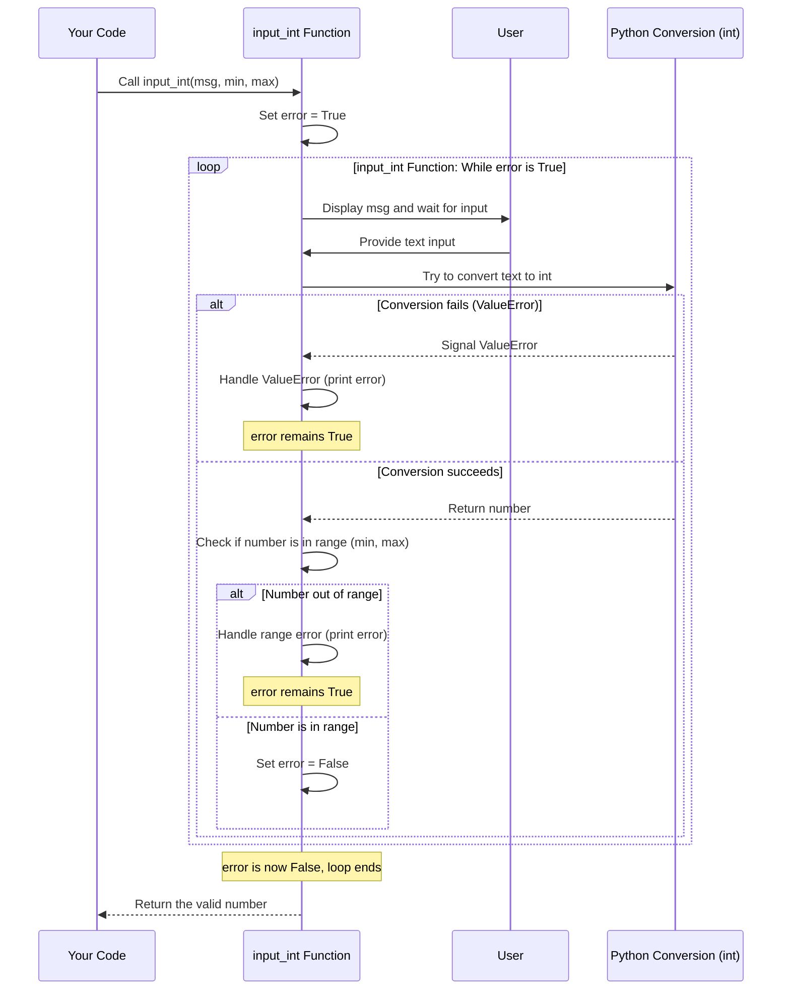

# Chapter 7: Input Validation Functions

Welcome back! In the [previous chapter](06_data_collections_.md), we explored **Data Collections** like Lists and Dictionaries, which help us organize multiple pieces of data. Often, the data we put into these collections, or the numbers we use in calculations, come directly from the user through the `input()` function.

However, there's a problem with the basic `input()` function: it always reads what the user types as **text** (a string). What happens if your program expects a number, and the user types "hello"? Your program will likely crash with an error like `ValueError` when you try to convert "hello" into an integer or a float.

Also, even if the user *does* type a number, what if the number isn't valid for your specific task? If you're asking for an age, a negative number like -5 doesn't make sense. If you're asking for a percentage, 150 is probably invalid.

This is where **Input Validation Functions** become essential. They are like helpful assistants whose job is to get input from the user and make *absolutely sure* it's in the correct format and within an acceptable range *before* handing it over to the rest of your program. They act as a safeguard against bad data.

In the `lp20251` project, you'll find examples of these functions, notably in `biblioteca.py` and also re-implemented in `p1.py`. Their main goal is to make getting numbers (integers or floating-point) from the user safe and reliable.

## Why Do We Need Them? (The Problem)

Let's see the problem with basic input:

```python
# Basic input - can cause problems
try:
    age_text = input("Please enter your age: ")
    age = int(age_text) # What if the user types "twenty"?
    print(f"You are {age} years old.")
except ValueError:
    print("That wasn't a valid number for age!")

# What if they type -5? The program won't crash, but the age is invalid!
# How do you check the range?
```

The `try...except` helps catch the `ValueError` if the user types non-numeric text. But it doesn't handle negative ages or other range issues. And if you need to ask for a number multiple times in your program, you'd have to write `try...except` blocks and range checks everywhere! That's repetitive and makes your code longer and harder to read.

## The Solution: Reusable Validation Functions

Instead of scattering input-checking code throughout your program, you can put it all into a dedicated function. This function will handle the `input()`, the conversion (`int()` or `float()`), the error checking (`try...except`), and the range validation (`if min <= number <= max`), and keep asking the user until they provide valid input. Only then does the function finish and *return* the good, clean number.

This is exactly what the `input_int()` and `input_float()` functions in `biblioteca.py` (and `p1.py`) do.

Let's look at the `input_int` function from `biblioteca.py` (simplified slightly for clarity):

```python
# From biblioteca.py (simplified)
def input_int(msg, min, max):
    error = True # Start assuming there's an error, so the loop runs
    numero = 0   # Variable to hold the valid number

    while error == True: # Keep looping AS LONG AS error is True
        try:
            # --- Attempt to get input and convert ---
            numero = int(input(msg))

            # --- Check the range (only if conversion succeeded) ---
            if numero < min or numero > max:
                print(f'Valor informado fora do intervalo permitido {min}-{max}')
                # error remains True, so the loop will continue

            else:
                # --- Input is VALID (correct type AND in range) ---
                error = False # Set error to False to stop the loop

        except ValueError:
            # --- Handle Type Error (user typed non-integer text) ---
            print('O valor informado não é um número Inteiro!')
            # error remains True, so the loop will continue

        except:
            # --- Handle other unexpected errors (simplified) ---
            print('Erro desconhecido!')
            # error remains True, so the loop will continue

    # --- Loop finished (error is now False) ---
    return numero # Return the valid number
```

The `input_float()` function works almost identically, just using `float()` instead of `int()`.

## How `input_int` (and `input_float`) Work

Let's break down the steps `input_int(msg, min, max)` follows when you call it:

1.  **Start Loop:** It sets a flag `error` to `True` and enters a `while error == True:` loop. This loop will repeat until `error` becomes `False`.
2.  **Prompt User:** Inside the loop, it displays the message (`msg`) you provided using `input()`, and waits for the user to type something and press Enter.
3.  **Attempt Conversion (`try`):** It attempts to convert the user's input (which is text) into an integer using `int()`. This happens inside a `try` block because it might fail.
4.  **Check Range (`if`):** *If* the conversion to `int()` was successful, it then checks if the resulting `numero` is less than `min` or greater than `max`.
5.  **Input Valid? (`else`):**
    *   If the conversion succeeded *AND* the number is within the allowed `min` and `max` range, the code enters the `else` block. It sets `error` to `False`.
    *   If the conversion succeeded *BUT* the number is *outside* the allowed range, it prints an "out of range" error message. `error` remains `True`.
6.  **Input Invalid Type? (`except ValueError`):** If the `int()` conversion failed (e.g., user typed letters), the `except ValueError:` block runs. It prints an error message explaining the problem. `error` remains `True`.
7.  **Other Errors? (`except`):** Catches any other unexpected errors. `error` remains `True`.
8.  **Loop Continues or Stops:**
    *   If `error` is still `True` (either due to invalid type or out-of-range number), the `while` condition `while error == True` is still `True`, and the loop repeats from step 2, asking the user for input again.
    *   If `error` became `False` (because valid input in the correct range was received), the `while` condition `while error == True` is now `False`, and the loop *stops*.
9.  **Return Value:** After the loop finishes, the function executes the `return numero` line, sending the valid integer back to the part of your program that called the function.

Here's a simplified sequence diagram illustrating the flow for `input_int`:



This process guarantees that when `input_int` or `input_float` finishes, the number it returns is *definitely* of the correct type and within the specified minimum and maximum values.

## Using Input Validation Functions in Your Code

Let's see how using these functions simplifies the code that *needs* the input. Compare the earlier example with using `input_int`:

```python
# Using the input_int validation function
# Imagine this is inside a qXX function
# from listaX.py or p1.py

# Ask for age between 0 and 120
age = input_int("Please enter your age (0-120): ", 0, 120)

# Now you KNOW 'age' is a valid integer between 0 and 120
print(f"You are {age} years old.")

# You can use 'age' safely in calculations or logic
if age >= 18:
    print("You are an adult.")
else:
    print("You are a minor.")
```

Notice how clean and simple the code that calls `input_int` is! You don't need `try...except` or complex `while` loops and `if` checks right here. All that complex validation logic is hidden *inside* the `input_int` function. This makes your main code much easier to read and write.

Look at `q1` in `p1.py`:

```python
# From p1.py, q1 (simplified)
def q1():
    # Use input_float to safely get saldo between 0 and 1 billion
    saldo = input_float('Saldo: R$ ', 0, 1_000_000_000)

    # Basic input for juros (LESS SAFE in the original, improved in q3)
    # try:
    #     juros = float(input('Juros: '))
    # except ValueError:
    #     print('O juros informado não é um número Real!')
    # This part is less safe because it only catches ValueError once.
    # A validation function would loop until valid juros is given,
    # and could also check if juros is non-negative, like in q3's loop.

    # Assuming juros was entered successfully (or using a validation function):
    # print(f'Rendimento 1 mês: {saldo*juros/100}')

    # Original p1.q1 has a more basic error handling structure
    # that q3 improves upon by using a loop for juros validation.
    pass # Placeholder - actual q1 is slightly different but uses input_float
```

The key takeaway from `p1.py` is how `input_float` is used in `q1` to get the `saldo` value. Although `q1`'s handling of `juros` is less robust (it doesn't loop for valid input if the first attempt fails, a problem addressed in `q3`), the use of `input_float` for `saldo` clearly shows the benefit: it handles the type conversion (`float`) and range check (`0` to `1_000_000_000`) automatically, ensuring that `saldo` is a usable number when the line `saldo = ...` finishes.

`q3` in `p1.py` shows a `while` loop used directly in the `qXX` function *before* calculating `juros`, effectively implementing a form of input validation specifically for the `juros` variable, demonstrating the core loop-until-valid pattern seen inside the dedicated validation functions.

## Where to Find Them

*   `biblioteca.py`: This file is intended to contain general-purpose helper functions like `input_int` and `input_float` that could be useful in many different programs.
*   `p1.py`: In this specific project file (which seems to be related to a practical exam), the `input_float` function is re-implemented directly within the file. This might be done to ensure the student demonstrates the ability to write such functions themselves, rather than just importing them. The logic is identical or very similar to the version in `biblioteca.py`.

Regardless of *where* they are defined, their *purpose* is the same: to provide a safe, reusable way to get numeric input within specified bounds from the user, making the calling code cleaner and more reliable.

## Conclusion

In this chapter, you learned about **Input Validation Functions**. These are crucial helper functions (like `input_int` and `input_float` in `biblioteca.py` and `p1.py`) that encapsulate the logic for getting user input, handling potential errors like incorrect types (`ValueError`), checking if the input is within an acceptable range, and repeatedly asking the user until valid input is provided.

Using these functions makes your programs more robust, preventing crashes due to bad input and simplifying the code that needs to use the validated data. They demonstrate the power of functions ([Chapter 2: Exercise/Question (qXX Function)](02_exercise_question__qxx_function__.md)) for creating reusable code blocks.

So far, we've focused on text-based input and output in the console. In the next chapter, we'll explore how to create graphical user interfaces (GUIs) using Tkinter, where getting user input safely is just as important, even with buttons and text boxes!

[Next Chapter: GUI Programming (Tkinter)](08_gui_programming__tkinter__.md)

---

<sub><sup>Generated by [AI Codebase Knowledge Builder](https://github.com/The-Pocket/Tutorial-Codebase-Knowledge).</sup></sub> <sub><sup>**References**: [[1]](https://github.com/ifmt-cba/lp20251/blob/2353bfea16374996818c71298b449a71933ddc9f/biblioteca.py), [[2]](https://github.com/ifmt-cba/lp20251/blob/2353bfea16374996818c71298b449a71933ddc9f/p1.py)</sup></sub>