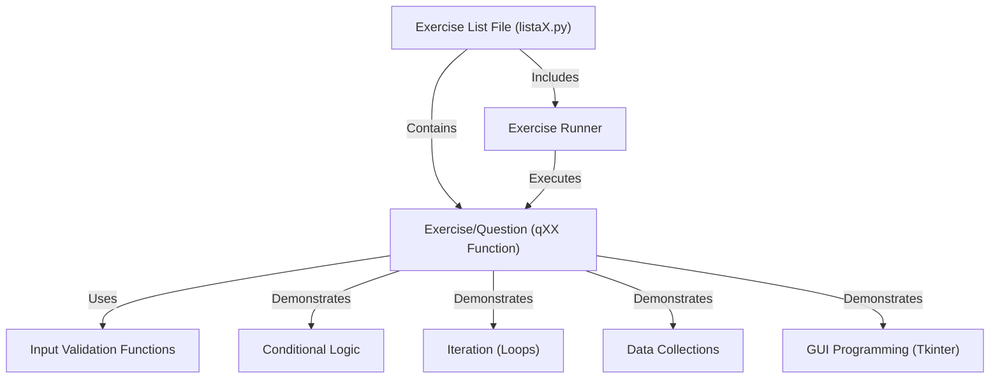

# Tutorial: lp20251

This project is a collection of Python **programming exercises**, organized into different files like chapters in a book. Each exercise is a self-contained function that solves a specific problem. The project includes a simple **runner** to easily select and execute any exercise, and also demonstrates core programming concepts like **conditional logic**, **loops**, **data structures**, **input validation**, and even simple **GUI programming**.

## Visual Overview

## Chapters

1. [Exercise Runner
](01_exercise_runner_.md)
2. [Exercise/Question (qXX Function)
](02_exercise_question__qxx_function__.md)
3. [Exercise List File (listaX.py)
](03_exercise_list_file__listax_py__.md)
4. [Conditional Logic
](04_conditional_logic_.md)
5. [Iteration (Loops)
](05_iteration__loops__.md)
6. [Data Collections
](06_data_collections_.md)
7. [Input Validation Functions
](07_input_validation_functions_.md)
8. [GUI Programming (Tkinter)
](08_gui_programming__tkinter__.md)

---

Generated by [AI Codebase Knowledge Builder](https://github.com/The-Pocket/Tutorial-Codebase-Knowledge).